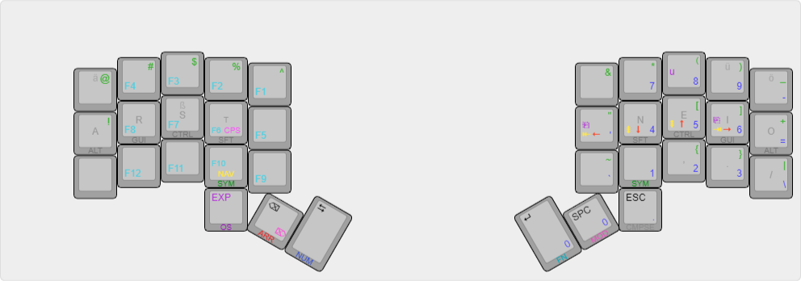

# dtk_3x5
A custom 3x5 +3 keyboard layout. It's a folded version of the 3x6 +3 layout I've been using before, which itself was a more more compact version of a layout I had developed for use with my OG ErgoDox.

 - The base layer is Colemak-DH, but should be compatible with many other layouts for alphas.
 - Numbers are on a cross-hand thumb-triggered num pad layer centered on the homerow of the right hand.
 - Symbols live on a layer toggled with the index fingers and are inspired by their position on Colemak (and by extension QWERTY).
 - Navigation is handled by a Vim style `hjkl` cluster

The goal of this layout is not outright efficiency, but rather familiarity and to some degree consistency with Colemak (preserving finger assignments for symbols where justifiable), in order to not unlearn what I learnt in countless painful lessons ;P

# Genesis

  

